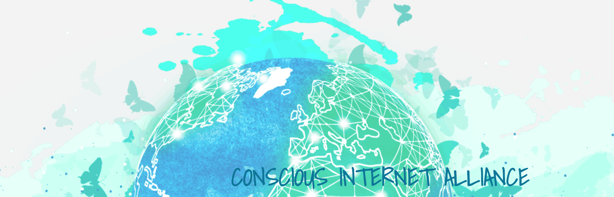

A collaborative ecosystem of projects and ambassadors that are expanding and distributing social and environmental goods in a decentralized, peer to peer manner for humanity and our planet

**We aim to empower +1 Billion people with sustainable access to complementary education, internet, and currencies (banking) for
less than $1 per month.**

**Unlimited access to education**

> Education is empowerment. We focus on education content as well as the required tools to provide education to a billion people. Through simple technologies like video conferencing, and the infrastructure technology from ThreeFold, we connect students with educators around the world.

**Complementary digital currencies**

> Our Digital Nation needs a set of safe complementary digital currencies. They need to be compatible with our existing fiat currencies, maintain their value in all situations, globally usable, freely exchangeable and cannot be abused by centralized organizations or hackers.

**Connectivity, Internet and information**

>  We need a safe and cost effective new Internet. The current one is too expensive, power hungry, centralized and not scalable enough. We need a better 100% decentralized alternative owned by us all.

**Our "Digital Self" needs to be owned by our selves**

> We are  cyborgs – our phones are an extension of our minds, they make us smarter and faster. Our identity and data on the Internet is our "Digital Self," which we unfortunately don't own. We became a product and need our freedom back.

# Values 

We, the citizens of FreeFlow Nation, believe that the world needs a new nation - a global complementary Digital Nation. A nation to complement not replace our existing nations, a nation which has no physical boundaries and which welcomes everyone as a digital citizen.

## FreeFlow Rights

**Everyone has access to affordable education, Internet, healthcare and financial systems**

> Through education, people can improve the living standards for themselves and for their children. Education is the gateway to a better life.
For more than 3 billion people in the world today above mentioned digital commodities are not available nor affordable. Cost of the information system needs to be lower.

**Everyone has equal chances**

> Everyone has equal chances. Independent of location, race, gender, religion, etc. leaving no one behind. Everyone can deliver services or products to everyone in all transparency and fairness.

**Everyone has the right to a safe, healthy, and secure environment**

> Everyone has the right to a safe, healthy, and secure environment
Safety and health are human rights. Feeling safe is crutial for our well-being as individuals. Our money and personal information needs to be protected. Systems need to be safe & healthy (e.g. current 5G is potentially harmful).

## FreeFlow Declaration

**We declare that we have power and we need to act.**

> The world needs healing. There is too much talk and not enough action. We believe that we have the power. We shouldn’t blame others – governments, society, politicians or other countries. We all are at the source of the problems the world is facing today, and together we can do something about it.  
> We have a responsibility to improve the things we can have an impact on instead of blaming others around us.
This doesn’t mean we have no right to a financially comfortable life, it means we have to act and help heal the world. If we all change our actions towards what we can have a positive impact on, the world would be a better place tomorrow.

**We declare that respect is the basis of our communication and action**

> We declare that respect instead of fear or ego will be the basis of our communication and our action in this digital nation.
We don’t have to agree but respect and tolerance for other opinions is a must. We need to respect time, e.g. time of others and our own.

**We declare to respect the world’s finite resources**

> We need to be respectful for finite world resources.
We will actively look to purchase products which are more sustainable.
We declare that we want to produce high quality and sustainable products or services.

**We declare to produce fair and honest information**

> We should be critical about the information we consume, not take information at face value. We need to try to create information which is in line with the reality. We should never create information to deceive people.

**We agree that no-one should ever be a product**

> We have become a product of a big data machine.
> Every action we take on social media, Internet searches, etc, is potential profit for someone else.  
> We should stop believing that we are getting these services for free.
> This leads to manipulation and too much a consumption of our world’s resources. This means we accept to pay for resources used.

## Digital Nation information laws

The following laws are the fundamental information rights of our new internet.

**Information is owned by the author(s)**

> We have sole ownership of our created information/content (e.g. photos, text, videos).  
> “We” can be an organization (company, government, etc) or a person. 

**Everyone has control over his or her own information and community circles**

> We define the circles (groups of people) we want to communicate with.  
> We have absolute freedom to decide what we want to share, and with whom we want to share it.  
> We can at any point in time retrieve/destroy our information or revoke access rights.  

**Information cannot be changed or read without the consent of the author(s)**

> No one has access to our information unless we have given explicit access rights. It should be technically impossible for a hacker or other organization to change information and represent it in another way than originally intended.

**Information is neutral and can be verified**

> We can ask for verification of the information at any point in time.   
> We have the ability to search and consume information in freedom and neutrality.  
> We don’t like that an AI (Artificial Intelligence) machine decides what information gets priority or is blocked. Today we navigate in a restricted information world, much smaller than we believe. Keeping us uninformed and manipulating the information which is being presented to us can influence our consumption and voting actions.

**Exchange of value should be a free**

> The act of exchanging anything should be free of charge and not controlled by anyone. Anything can be exchanged, everywhere by everyone.

**Law enforcement access to information is important but should not be abused**

> Safety is important. Governments or law enforcement agencies should be able to access information when required in all transparency (means authors know what rights governments have and when exercised) and for the right reason.  
> This access should never be abused for other reasons as public safety.
> This right should not lead to unnecessary censorship.